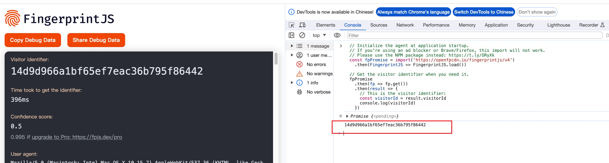

# fake fingerprint

生成虚假的浏览器指纹

[English](./README.md)

# 示例

运行[指纹](https://fingerprintjs.github.io/fingerprintjs/)生成.

没有进行处理前:



进行处理后:


# 安装

```shell
npm install fake-fingerprint
```

# 使用

```js
import FakeFingerPrint from "fake-fingerprint";

const instance = new FakeFingerPrint({
  config: {
    /* 浏览器的navigator对象. 能够对它的一些属性进行自定义配置. */
    navigator: {
      userAgent: "Custom UA",
      // 更多的navigator属性
    },
    /* 浏览器的screen对象. 能够对它的一些属性进行自定义配置. */
    screen: {
      width: 9999,
      height: 88,
      // 更多的screen属性
    },
    canvas: {
      fillText: "hello fake",
    },
    audio: {
      strength: 100,
    },
    timezone: {
      zone: "America/New_York",
      locale: "en-US",
      offset: -5,
    },
    webGL: {
      driver: "ANGLE (NVIDIA GeForce GTX 1050 Ti Direct3D11 vs_5_0 ps_5_0)",
    },
    webRTC: {
      address: "127.0.0.1",
    },
  },
  /* 
   当调用修改的方法或访问代理的属性时报告
    例如:{type:'navigator',key:'UserAgent'}  
  */
  report: (arg) => {
    console.log("arg:", arg);
  },
  /* 当这些属性被访问的时候进行报告  */
  reportKeys: ["userAgent", "appVersion", "toDataURL"],
});

instance.open();
```

# API

`FakeFingerPrint`的参数.

|    名称    |                          描述                          |   类型   | 是否必须 |
| :--------: | :----------------------------------------------------: | :------: | :------: |
|   config   |                     指纹生成的配置                     |  object  |    否    |
|   report   |         当方法或者属性被访问的时候，它将被调用         | function |    是    |
| reportKeys | 需要进行报告的key值，如果不传那么所有的key都会进行报告 |  key[]   |    否    |

`config`:

|   名称    |                                 描述                                  |                                  例子                                   |
| :-------: | :-------------------------------------------------------------------: | :---------------------------------------------------------------------: |
| navigator | 浏览器的navigator对象, 你可以配置UA,appAgent和其他的navigator对象信息 |                 {userAgent: "Custom UA",appName: "123"}                 |
|  screen   |   浏览器的screen对象, 你可以配置width,height和其他的screen对象信息    |                         {width:8888,height:123}                         |
|  canvas   |         当toDataURL方法被调用的时候,自定义生成fillText的信息          |                            {fillText:'test'}                            |
|   audio   |                当生成指纹的时候，自定义添加的噪音强度                 |                             {strength: 100}                             |
| timezone  |      自定义时区信息， offset是相对于标准时间的偏移量, 单位是小时      |          {zone: "America/New_York",locale: "en-US",offset: -5}          |
|   webGL   |                          返回渲染的设备信息                           | {driver: "ANGLE (NVIDIA GeForce GTX 1050 Ti Direct3D11 vs_5_0 ps_5_0)"} |
|  webRTC   |                          自定义的ip地址信息                           |                          {address:"127.0.0.1"}                          |

# 证书

MIT [@hemengke1997](https://github.com/hemengke1997)

# 灵感

by [my-fingerprint](https://github.com/omegaee/my-fingerprint)
