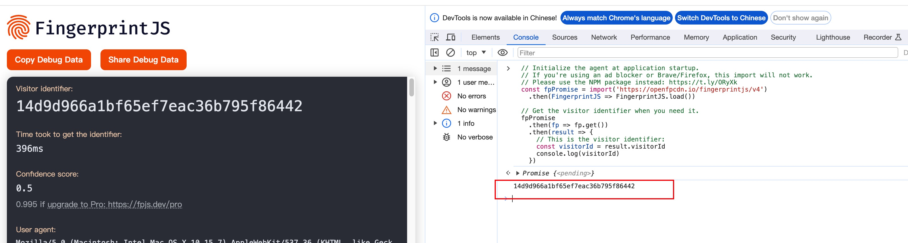
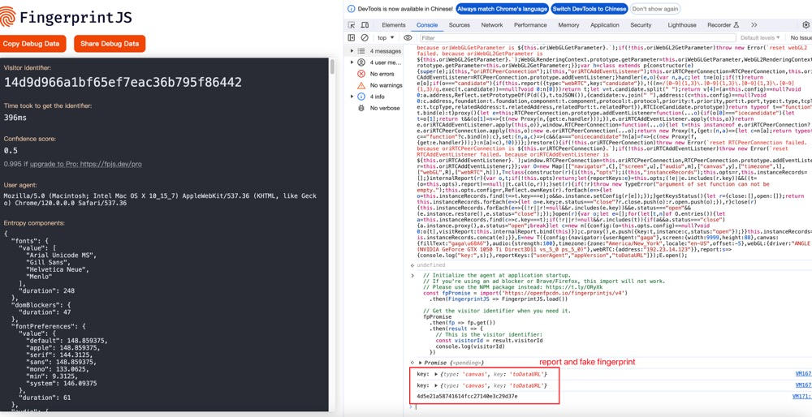

# fake fingerprint

generate fake fingerprint of brower.

[简体中文](./RADEME-ZH.md)

# Example

run [fingerprint](https://fingerprintjs.github.io/fingerprintjs/) genreate.

no fake before:



fake after:



# Install

```shell
npm install fake-fingerprint
```

# Usage

```js
import FakeFingerPrint from "fake-fingerprint";

const instance = new FakeFingerPrint({
  config: {
    /* navigator object of browser. can change it's some property. */
    navigator: {
      userAgent: "Custom UA",
      // more navigator value
    },
    /* screen object of browser. can change it's some property. */
    screen: {
      width: 9999,
      height: 88,
      // more screen value
    },
    canvas: {
      fillText: "hello fake",
    },
    audio: {
      strength: 100,
    },
    timezone: {
      zone: "America/New_York",
      locale: "en-US",
      offset: -5,
    },
    webGL: {
      driver: "ANGLE (NVIDIA GeForce GTX 1050 Ti Direct3D11 vs_5_0 ps_5_0)",
    },
    webRTC: {
      address: "127.0.0.1",
    },
  },
  /* 
    Report when the modified method is called or the properties of the proxy are accessed. 
    eg:{type:'navigator',key:'UserAgent'}  
  */
  report: (arg) => {
    console.log("arg:", arg);
  },
  /* report when these keys are accessed  */
  reportKeys: ["userAgent", "appVersion", "toDataURL"],
});

instance.open();
```

# API

arguments of `FakeFingerPrint`.

|    name    |                          explain                           |   type   | required |
| :--------: | :--------------------------------------------------------: | :------: | :------: |
|   config   |            generate the configuration fake uses            |  object  |    no    |
|   report   | when property or function to be visit. It‘s will be invoke | function |   yes    |
| reportKeys |  need keys of report. default null, will report all keys   |  key[]   |    no    |

`config`:

|   name    |                                            explain                                            |                                 example                                 |
| :-------: | :-------------------------------------------------------------------------------------------: | :---------------------------------------------------------------------: |
| navigator | navigator object of browser, You can configure UA,appAgent other navigator object information |                 {userAgent: "Custom UA",appName: "123"}                 |
|  screen   | screen object of browser, You can configure width,height and other screen object information  |                         {width:8888,height:123}                         |
|  canvas   |                       when invoked toDataURL, custom genereate fillText                       |                            {fillText:'test'}                            |
|   audio   |                      when genreate fingerprint. need add noise strength                       |                             {strength: 100}                             |
| timezone  |       custom timezone info. offset is Offset equivalent to standard time, unit is hour        |          {zone: "America/New_York",locale: "en-US",offset: -5}          |
|   webGL   |                                 reutrn driver of information                                  | {driver: "ANGLE (NVIDIA GeForce GTX 1050 Ti Direct3D11 vs_5_0 ps_5_0)"} |
|  webRTC   |                                      custrom ip address                                       |                          {address:"127.0.0.1"}                          |

# License

MIT [@hemengke1997](https://github.com/hemengke1997)

# Inspiration

by [my-fingerprint](https://github.com/omegaee/my-fingerprint)
